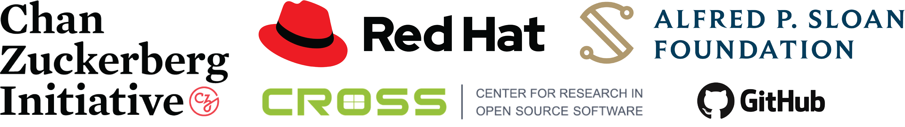


label: REGISTRATION
link: https://www.eventbrite.com/e/uc-open-2025-tickets-1253650846429?aff=ebdssbdestsearch


The University of California Open Summit (UC Open) 2025 will highlight the value open source has to the UC system and how UC contributions are a benefit to open source communities. This event welcomes UC faculty, technical staff, and students, as well as the industry and open source community interested in collaborating with UC researchers. The UC Open aims to leverage participants' experience, knowledge, and expertise in order to increase the impact of the research and education on UC campuses. Our keynotes, panels, directed discussions and technical sessions will cover a wide range of issue relevant to open source communities inside and outside academia.

Special attention will be given to common challenges facing open source communities in the UC-system, and ways that collaborating across sectors can help meet these challenges.

We are also excited to announce that the event will include a special meet & greet and **book signing with [Arun Gupta](https://www.linkedin.com/in/arunpgupta/)**, author of [_Fostering Open Source Culture: Increase Innovation and Deliver Faster with Open Source_](https://link.springer.com/book/10.1007/979-8-8688-0977-4). A limited number of copies will be available on a first-come, first-served basis. Attendees are also welcome to bring their own copy for signing. We are excited to provide this opportunity to connect with the author and gain insights into fostering a thriving open source culture.

This isn't just another professional obligation. UC Open promises to be:

- **Genuinely enjoyable**: we’ve made sure to include breaks long enough to recharge your attention span and have meaningful conversations.
- **Small but mighty**: our deliberately limited capacity means you’ll leave with real relationships, not just business cards. Every conversation matters when you're part of a curated community rather than a sea of strangers.
- **Warmly collaborative**: this conference is for humans, not sales. Whether you're a researcher, maintainer, contributor, or simply curious about open source innovation, you'll find your people here.

_Thanks to the generosity of our sponsors, we are able to make this event **free of charge** for all participants and we will provide a light breakfast and lunch on both days as well as a buffet/reception at the end of the first day._

**Date: 23 & 24 April 2025**

**Location: [UCSC Silicon Valley Campus](https://siliconvalley.ucsc.edu/facility/) Santa Clara, CA**

## Sponsorship

This event is made possible by generous support from Platinum sponsors Red Hat, the Chan Zuckerberg Initiative, and the Alfred P. Sloan Foundation. Additional support is provided by UCSC's Center for Research in Open Source Software (Silver sponsor) and GitHub (Bronze sponsor). Thank you all!

If your organization also wants to support open source innovation & research in academia – and foster collaboration across industry, universities & OS communities – check out our [sponsorship opportunities](./sponsor/_index.md). Individuals can also make donations to support our efforts. [Contact the organizers](mailto:slieggi@ucsc.edu) for more details.

## Agenda

### Wednesday, April 23 2025

<table border='1' cellpadding='3' style='border-collapse:collapse'><thead>
  <tr>
    <th>Time</th>
    <th colspan="2">Session</th>
  </tr></thead>
<tbody>
  <tr>
    <td>9:00-9:30</td>
    <td colspan="2">Breakfast &amp; Registration</td>
  </tr>
  <tr>
    <td>9:30-9:50</td>
    <td colspan="2"><b>Opening Session</b>  <em>Featuring remarks from Alexander Wolf (Dean, UCSC Baskin Engineering)</em></td>
  </tr>
  <tr>
    <td>9:50-10:50</td>
    <td colspan="2"><b>Panel</b>: <em><a href="../uc-open-4-2025/sessions/from-idea-to-impact">From Idea to Impact — Charting Creation and Adoption of Open Source Coming from Academia</a></em> Moderator: <a href="../uc-open-4-2025/speakers/stephanie-lieggi">Stephanie Lieggi</a> (CROSS / UCSC) Panelists: <a href="../uc-open-4-2025/speakers/fernando-perez">Fernando Perez</a>
 (UCB and Jupyter), <a href="../uc-open-4-2025/speakers/bin-fan">Bin Fan (Alluxio)</a>, and <a href="../uc-open-4-2025/speakers/tony-wasserman">Tony Wasserman</a></td>
  </tr>
  <tr>
    <td>10:50-11:10</td>
    <td colspan="2">Break and Networking</td>
  </tr>
  <tr>
    <td>11:10-11:50</td>
    <td colspan="2"><b>Fireside Chat</b>: <em><a href="../uc-open-4-2025/sessions/commercial-open-source">Commercial Open Source Software: How Innovators Profit by Giving Software Away</a></em> <a href="../uc-open-4-2025/speakers/heather-meeker">Heather Meeker</a> (Partner, Tech Law Partners LLP, and co-founder, Chinstrap Community) and James Davis (UCSC)</td>
  </tr>
  <tr>
    <td>11:50-12:30</td>
    <td colspan="2"><b>Keynote</b>: <em><a href="../uc-open-4-2025/sessions/building_inclusive_communities">Building Inclusive Open Source Communities: What the Data Says & How Academia Can Lead</em> <a href="../uc-open-4-2025/speakers/kenyatta-forbes">Kenyatta Forbes</a> (GitHub - Open Source Programs)</td>
  </tr>
  <tr>
    <td>12:30-2:00</td>
    <td colspan="2">Lunch &amp; Networking</td>
  </tr>
  <tr>
    <td>2:00-2:40</td>
    <td colspan="2"><b>Keynote</b>: <em><a href="../uc-open-4-2025/sessions/wicked-little-problem">The Wicked Little Problem of Collaboration</a></em> <a href="../uc-open-4-2025/speakers/vm-brasseur">VM (Vicky) Brasseur</a> (vmbrasseur.com)</td>
  </tr>
  <tr>
    <td>2:40-3:30</td>
    <td colspan="2"><b>Panel</b>: <em><a href="../uc-open-4-2025/sessions/technology-transfer">Technology Transfer and Impact of Open Source</a></em> Moderator: <a href="../uc-open-4-2025/speakers/karla-padilla">Karla Padilla</a> (UCSD)  Panelists: <a href="../uc-open-4-2025/speakers/laleh-shayesteh">Laleh Shayesteh</a> (UCB), <a href="../uc-open-4-2025/speakers/marc-oettinger">Marc Oettinger</a> (UCSC), <a href="../uc-open-4-2025/speakers/joel-kehle">Joel Kehle</a> (UCLA), <a href="../uc-open-4-2025/speakers/angus-macdonald">Angus MacDonald</a> (UCOP)</td>
  </tr>
  <tr>
    <td>3:30-3:50</td>
    <td colspan="2">Break and Networking</td>
  </tr>
  <tr>
    <td>3:50-4:30</td>
    <td colspan="2"><b>Keynote</b>: <em><a href="../uc-open-4-2025/sessions/impact-open-source">The Impact of Open Source Software - Insights from Five Cycles of Essential Open Source Software for Science</a></em> <a href="../uc-open-4-2025/speakers/kate-hertweck">Kate Hertweck</a> (Chan Zuckerberg Initiative)</td>
  </tr>
  <tr>
    <td>4:30-5:00</td>
    <td colspan="2"><b>Lightning Intros</b> <em>Email <a href="mailto:elovell@ucsc.edu"> Emily Lovell</a> to learn more or to add your name to the signup list!</em></td>
  </tr>
  <tr>
    <td>5:00-6:30</td>
    <td colspan="2"><b>Reception and Book Signing/Meet and Greet with Arun Gupta</b></td>
  </tr>
</tbody></table>

### Thursday, April 24 2025

<table border='1' cellpadding='3' style='border-collapse:collapse'><thead>
  <tr>
    <th>Time</th>
    <th>Track 1 (Event Space 2110)</th>
    <th>Track 2 (Seminar Room 2225)</th>
  </tr></thead>
<tbody>
  <tr>
    <td>9:00-9:30</td>
    <td colspan="2">Breakfast &amp; Registration</td>
  </tr>
  <tr>
    <td>9:30-10:20</td>
    <td colspan="2"><b>Panel</b>: <em>Open S#####? Understanding What is Meant by “Open”</em> Moderator: Kirstie Whitaker (UCB) Panelists: Jarrod Millman (UCB), Kristen Ratan (Strategies for Open Science)</td>
  </tr>
  <tr>
    <td>10:30-11:20</td>
  <td><b>Technical Session</b>: <em><a href="../uc-open-4-2025/sessions/oss-security-ai">Open Source Software Security in AI</a></em> Presenter: <a href="../uc-open-4-2025/speakers/mihai-maruseac">Mihai Maruserac</a> (Google) Moderators: <a href="../uc-open-4-2025/speakers/alvaro-cardenas">Alvaro Cardenas</a> (UCSC) and <a href="../uc-open-4-2025/speakers/juanita-gomez">Juanita Gomez</a> (UCSC)</td>
  <td><b>Directed Discussion</b>: <em><a href="../uc-open-4-2025/sessions/licensing">ABCs of Open Source Licensing</a></em> Including opening discussion with <a href="../uc-open-4-2025/speakers/karla-padilla">Karla Padilla (UCSD)</a> and <a href="../uc-open-4-2025/speakers/jeff-shapiro">Jeff Shapiro</a> (Linux Foundation)</b></td>
  </tr>
  <tr>
    <td>11:25-12:35</td>
    <td><b>Technical Session</b>: <em><a href="../uc-open-4-2025/sessions/agrifood">Open Source for Agrifood – Perspectives from Academia and Industry</a></em> Moderator: <a href="../uc-open-4-2025/speakers/rob-trice">Rob Trice</a> (Better Food Ventures) Panelists: <a href="../uc-open-4-2025/speakers/colleen-josephson">Colleen Josephson</a> (UCSC/Agtech Alliance), <a href="../uc-open-4-2025/speakers/priscilla-koepke">Priscilla Koepke</a> (F3 Innovate), <a href="../uc-open-4-2025/speakers/gabe-youtsey">Gabe Youtsey</a> (UCANR), <a href="../uc-open-4-2025/speakers/drew-zabrocki">Drew Zabrocki</a> (International Fresh Produce Association)</td>
    <td><b>Technical Session</b>: <em><a href="../uc-open-4-2025/sessions/sustainability">OSS Sustainabillity</a></em> Moderator: Amber Budden (UCSB)</td>
  </tr>
  <tr>
    <td>12:35-2:00</td>
    <td colspan="2">Lunch &amp; Networking</td>
  </tr>
  <tr>
    <td>2:00-2:50</td>
    <td><b>Technical Session</b>: <em><a href="../uc-open-4-2025/sessions/vllm">vLLM: A success story of UC and industry collaboration in Open Source AI</a></em> Presenter/Moderator: <a href="../uc-open-4-2025/speakers/nick-hill">Nick Hill</a> (RedHat)</td>
    <td><b>Directed Discussion</b>: <em><a href="../uc-open-4-2025/sessions/supporting-oss-contributions">Supporting Open Source Contributions from UC-affiliated Technologists</a></em> Moderator: <a href="../uc-open-4-2025/speakers/shawn-dearmond">Shawn DeArmond</a> (UCD)</td>
  </tr>
  <tr>
    <td>3:00-3:50</td>
    <td colspan="2"><b>Closing Session</b>: <em><a href="../uc-open-4-2025/sessions/how-can-we-help">How can we help? - Academic OSPOs Making an Impact at UC</a></em> Discussion moderated by UC OSPO Network Community Manager <a href="../uc-open-4-2025/speakers/laura-langdon">Laura Langdon</a></td>
  </tr>
</tbody></table>

## Logistics

Event Venue Address: [3175 Bowers Ave, Santa Clara, CA 95054](https://www.openstreetmap.org/directions?from=&to=37.379740,-121.976883#map=19/37.379619/-121.977135)
_Free parking available_

Venue reachable through [Valley Transportation Authority (VTA)](https://www.vta.org/) and [Caltrain](https://www.caltrain.com/).

### Hotel

We are arranging a room block at the Embassy Suites, Santa Clara Silicon Valley, which is a short walk from the meeting venue. Rate under our block is $269/night. Please contact [our event manager](mailto:ymartyno@ucsc.edu) for more details.

Additionally preferred rates are available at the following hotels for UC-affiliated attendees via [Connexxus](https://travel.ucop.edu/connexxus/):

- AC Hotel San Jose Santa Clara (closest to venue)

  - 2970 Lakeside Dr Santa Clara, CA 95054
  - 0.8 miles from SVC, 12 minute walk

- Santa Clara Marriott

  - 2700 Mission College Boulevard Santa Clara, California 95054
  - 1.6 miles from SVC, 34 min walk

- TownePlace Suites San Jose Cupertino
  - 440 Saratoga Ave San Jose, CA 95129
  - 5.5 miles from SVC

### Nearby Airports

The UCSC Silicon Valley Campus is about 6 miles away from San Jose Airport (SJC) and 30 miles from San Francisco Airport (SFO)

### Food

Light breakfast and lunch is provided on both days of the event. There will also be an evening reception on April 23. When you register you will be asked to provide any dietary restrictions or concerns.

### Travel Grants

We are working with our sponsors to provide travel stipends to UC affiliates interested in joining our event. Please [fill out this form](https://forms.gle/231icFHf4j5C4yWP8) if you would like to request a travel stipend.
