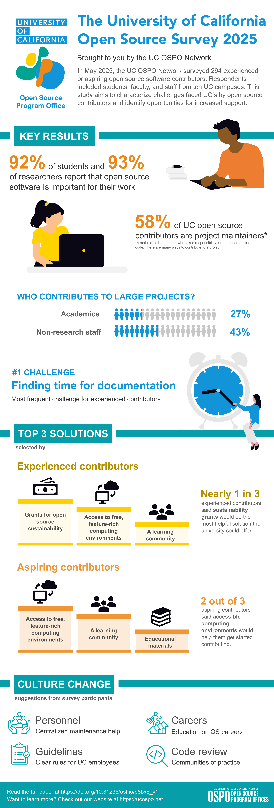

Welcome to the homepage for the 2025 UC Open Source Contributor Survey! Here
you'll find all the <a href="#links-to-research-products">artifacts associated
with this study</a>, a summary of what it's all about, and updates on our
ongoing research.

## Summary and key findings

Open source is an approach to software development that allows others to reuse
the source code and build their own program from it. Many open source projects
also welcome community contributions to the codebase. Much if not most academic
software is open source, but universities have historically prioritized other
types of research products. As a result, university policies, services, and
impact metrics often overlook the needs and accomplishments of open source
developers.

In May 2025, the UC OSPO Network conducted a survey to shed light on open source
activity at the University of California and to identify opportunities for
increased support. We received 294 responses from experienced or aspiring open
source contributors across ten UC campuses, a group that included students,
faculty, and staff.

<!-- Preview/thumbnail image -->

    

    
We found that the vast majority of students and researchers consider open source
software to be important for their work. We also found that the majority of open
source contributors at UC are project maintainers, meaning they are the primary stewards of a project.
Despite the importance and prevalence of open source software, about one-third
of respondents reported that they have shared their code on custom websites,
indicating that a large body of academic software is not located in standard
repositories. Contributors face many challenges in terms of resources, computing
infrastructure, and institutional culture. At the same time, the abundance of
maintainers and the prevalence of time and funding-related challenges underscore a critical need for support for
maintenance costs and overall sustainability of open source software.
    

    
Check out the study's key findings in our infographic! Click on the preview for
a closer look.
    

    

    

    

        
    

    <!-- Padding -->
    

    <!-- Download link -->
    <a style="padding-top: 10px; display: inline;" href="infographic.pdf"
        download="infographic.pdf">
        Download the infographic
    </a>

<!-- Modal (hidden by default) -->

<!-- Modal Image -->

    

<!-- Text that is hidden from view but will be read by screen readers -->

    
Here is the content of the infographic.

    
The University of California Open Source Survey 2025. Brought to you by the UC OSPO Network.

    
Key results. 92% of students and 93% of researchers report that open source is important for their work. 58% of UC open source contributors are project maintainers. Who contributes to large projects? 27% of academics and 43% of non-research staff occasionally or frequently contribute to large projects. The number one challenge, that is, the most frequent challenge for experienced contributors, was finding time for documentation.

    
A diagram shows the top three solutions preferred by experienced contributors and aspiring contributors. The order of the solutions is indicated by their position on a podium, in either first place, second place, or third place. The top three solutions preferred by experienced contributors were, in order: grants for open source sustainability, access to free, feature-rich computing environments, and a learning community. The top three solutions preferred by aspiring contributors were access to free, feature-rich computing environments, a learning community, and educational materials. Some text beside the first podium says that nearly one in three experienced contributors said that sustainability grants would be the most helpful solution the university could offer. Some text beside the second podium says that two out of three aspiring contributors said that accessible computing environments would help them get started contributing.

    
Other forms of support proposed by survey participants include the following:
        <ul>
            <li>Personnel: centralized maintenance help</li>
            <li>Careers: education on open source careers</li>
            <li>Guidelines: clear rules for UC employees</li>
            <li>Code review: communities of practice</li>
        </ul>
    

## Advice for Open Source Program Offices (OSPOs)

- The most common challenges that emerged from our study were **time and
  funding**. As such, OSPOs should consider either directly funding open source,
  or consider creative ways to “give back” time or money. Examples might include
  facilitating co-working groups, promoting AI tools for documentation, or
  providing support for external grant acquisition.

- We encountered high demand for affordable, accessible, feature-rich computing
  environments. This suggests an opportunity for academic OSPOs to help secure
  the **technical infrastructure** needed for open source development.

- Comments revealed three broad categories of concern: **Resources,
  Infrastructure, and Culture**. OSPOs should foster an **institutional
  culture** where open source activities are not merely monitored or regulated,
  but also supported, celebrated, and rewarded.

## Project status

We intend to continue deploying improved versions of this survey at UC again in
the future, perhaps every two years. If you deploy an open source survey at your
campus or in your academic community, we’d love to hear about it, whether or not
you used our survey instrument.

As part of the survey, we gave respondents the opportunity to share their GitHub
(GitLab, etc.) usernames with us. We plan to use these data to investigate
where, how, and how often UC contributors are contributing to small and large
open source repos. This may happen in the second half of 2026.

If you are interested in collaborating with us on this or on another research
effort, please reach out to us at ospo@library.ucsb.edu.

<h2 id=links-to-research-products> Links to research products </h2>

- **Preprint:** https://doi.org/10.31235/osf.io/p8bx6_v1
  - To find the preprint's supplementary materials, you have to go the 'Project'
    in OSF that has the same title as the preprint. Find it here:
    https://osf.io/m5ft6/overview
- The **data** will be here\*: https://doi.org/10.5061/dryad.2280gb662
- An archived snapshot of the **code** will be here\*:
  https://doi.org/10.5281/zenodo.17783102
  - \*These two DOIs will be functional after peer review. Please contact the
    authors if access is needed sooner.
- **Living code** repository:
  https://github.com/UC-OSPO-Network/ospo-survey-analysis
- **Survey instrument** is available as a PDF in the preprint's supplementary
  materials and in the GitHub repo. It will also available in .docx and .qsf
  formats in the Dryad dataset.
- **Lessons learned**, a retrospective on the survey instrument:
  https://github.com/UC-OSPO-Network/ospo-survey-analysis/blob/main/lessons_learned.md

