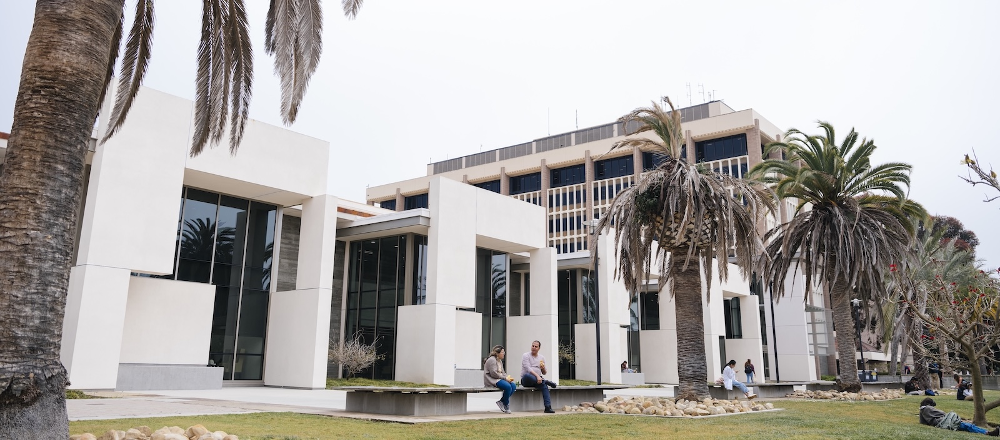

<!-- Using HTML since Hugo {{figure}} shortcode wasn't working for me -->

  
  <figcaption style="font-size: 0.5rem; margin-top: 0rem;">
  <em>Image courtesy of UCSB</em>
  </figcaption>

UC Santa Barbara has a strong history of leadership and innovation in open
source software development and open science. However, expertise and resources
have traditionally been distributed across various parts of the campus. The Open
Source Programs Team at UCSB serves as a central hub, bringing together open
source activities, expertise, and community connections.

UC Santa Barbara is a proud partner in the UC OSPO Network, collaborating
alongside five other UC campuses. Our support for both the UCSB community and
the broader network includes:

- Identifying and cataloging open source projects developed at UC campuses
- Creating educational materials, curricula, and best practice guidelines
- Offering services and resources aimed at ensuring the sustainability of open
  source projects

<!-- Colored box for current projects -->

<h2 style="margin-top: 1rem; margin-bottom: 1rem; text-align: center;">
Current projects
</h2>

### UCSB Open Source Meetup

  
  <figcaption style="font-size: 0.5rem; margin-top: 0rem;">
  <em>Image courtesy of LumenSt for Getty Images</em>
  </figcaption>

We are thrilled to be launching the UCSB Open Source Meetup! This group is open
to UCSB students, faculty, and staff who are interested in open source, and is
designed to help members build skills and connections. We will meet in-person
once a month, except a few months a year, in which **we will join other OSPO
Network campuses in a combined virtual meeting**. We will rotate between casual
discussions and talks from guest speakers (both UCSB and industry). If there is
demand, we may also do code reviews or mini-projects! Here are some of the
topics we’re thinking of discussing:

- CI/CD, unit tests
- Contributing guidelines and code style guides
- Getting started contributing
- Forking and branching
- Licensing
- Open source security, bug horror stories, bug awards?
- Building community
- Funding open source
- The history of open source
- Companies that have switched from open to closed licenses
- Open source AI

The in-person meetings will be on the first Wednesday of the month at noon in
room 1411 in the UCSB Library (inside the Sara Miller McCune Arts Library).
**Bring your lunch!**

- Join the
  [mailing list](https://lp.constantcontactpages.com/sl/hlmtgmY/ucsbospo)
- [Add it to your calendar](https://ucospo.net/events/) so you know which
  meetings are in-person and which are virtual.

### UC Open Source Survey

  
  <figcaption style="font-size: 0.5rem; margin-top: 0rem;">
  <em>Image courtesy of firmbee on Unsplash</em>
  </figcaption>

Our team recently spearheaded a survey of more than 200 open source contributors
as part of the UC OSPO Network’s discovery activities. You can read more about
the [structure of the survey here](https://ucospo.net/survey-launch/). We are
currently analyzing the data, and will circulate the results once published.
Until then, the survey instrument is available upon request, and we are happy to
answer questions.

## What's the status of the UCSB OSPO?

At present, UCSB does not have a dedicated Open Source Programs Office. Rather,
we have a cross-functional team of UCSB staff with knowledge and expertise in
open source who are developing the strategies, know-how, and connections needed
to create an OSPO.

We envision that the UCSB OSPO will:

- Help students, faculty, and staff to exchange knowledge and build connections,
- Promote open source awareness on campus,
- Advise on open source licenses,
- Help our campus to leverage the full potential of open source,
- And more!

Building on the work of the Open Source Programs Team, the OSPO will draw on
resources developed by the UC OSPO Network, and its priorities will be shaped by
both UC leadership and the UCSB open source community.

The current UCSB open source programs team includes staff members at the UCSB
Library, and we expect that the Library will continue to be the center of
gravity for this work for the foreseeable future.

## Get connected

  

- To stay informed about our activities,
  [join our mailing list](https://lp.constantcontactpages.com/sl/hlmtgmY/ucsbospo).
- For inquiries, email us at ospo@library.ucsb.edu.
- We’re also on Slack in the UC-Tech workspace, on the #open-source channel. If
  you’d like an invitation, please email us.
- Our team:
  - Virginia Scarlett, Open Source Programs Specialist
  - Amber Budden, Associate University Librarian for Digital Strategies
  - Jonathan Balkind, Assistant Professor of Computer Science
  - Greg Janée, Director, Research Data Services, UCSB Library
