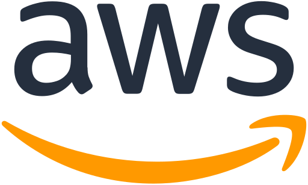
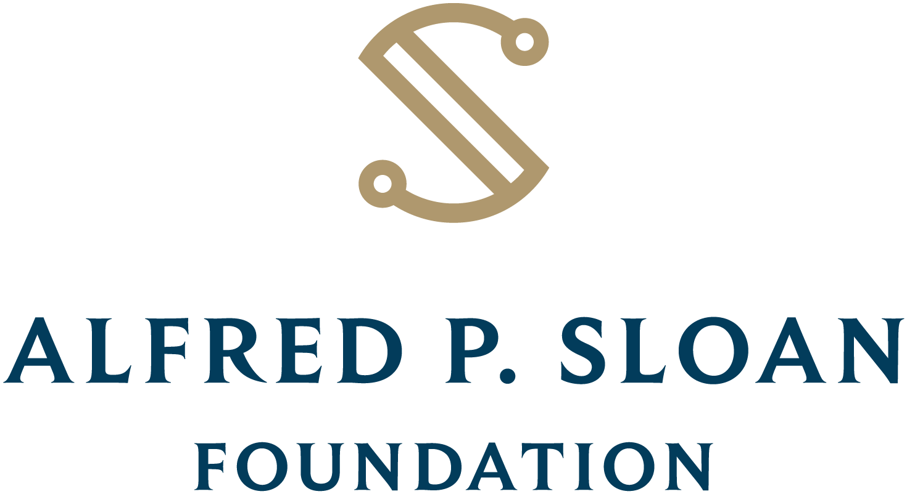
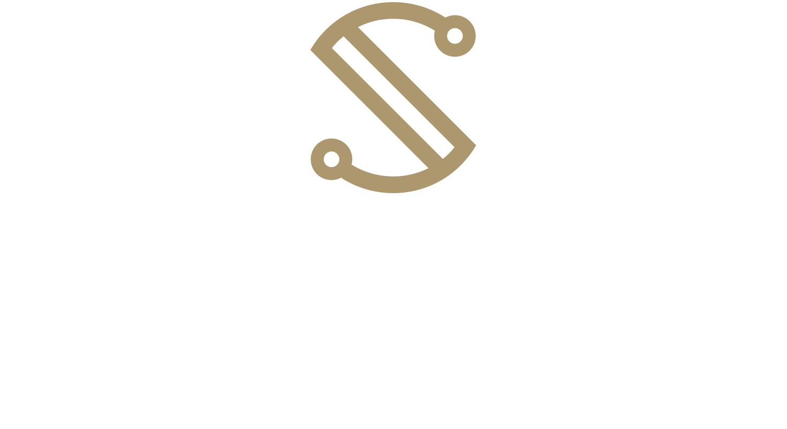

## April 22–23, 2026 | UC Berkeley

**[REGISTER NOW](https://www.eventbrite.com/e/uc-open-summit-2026-tickets-1984939679013?aff=oddtdtcreator&keep_tld=true)**

As open source reshapes research, infrastructure, and how academia connects with industry, the UC Open Source Summit 2026 brings together two days of collaboration and partnership. Researchers, developers, students, and industry leaders from across the University of California system will explore what's next—from AI's impact on academia to building sustainable research infrastructure.

Discover emerging UC projects before they reach the mainstream, build partnerships on production-ready technologies, and connect with the next generation of contributors. Whether you're looking for research partners, hiring talent, solving technical problems, or contributing expertise back to the academic open source community, UC Open 2026 connects university innovation with real-world application.

This isn't just another conference. UC Open is:

- **Genuinely enjoyable**: we build in breaks long enough to recharge your attention span and have real conversations.
- **Small but mighty**: our deliberately limited capacity means you'll leave with real relationships, not just business cards. Every conversation matters when you're part of a curated community rather than a sea of strangers.
- **Warmly collaborative**: this event is for humans, not sales pitches. Whether you're a researcher, maintainer, contributor, or simply curious about open source innovation, you'll find your people here.

_Thanks to the generosity of our sponsors, UC Open is **free to attend** for all participants! We will provide breakfast and lunch on both days, as well as an evening reception on Wednesday. When you register you will be asked to provide any dietary restrictions or concerns._

## Keynote Speakers

::::::{div}
:class: speaker-cards

::::{grid} 1 1 2 2

:::{card} David Charron

```{image} ./speaker-headshots/charron_david-1.jpg
:alt: David Charron
:width: 200px
```

Topic to be announced
:::

:::{card} Nithya Ruff

```{image} ./speaker-headshots/nithya-ruff.jpg
:alt: Nithya Ruff
:width: 200px
```

The Role of Foundations In Advancing Open Collaboration and Innovation
:::

::::

::::::

## Schedule at a Glance

::::{div}
:class: schedule-table

```{list-table}
:header-rows: 1
:align: center
:widths: 20 40 40

* -
  - **Wednesday, April 22**
  - **Thursday, April 23**
* - **Times**
  - 9:00 AM – 6:30 PM
  - 9:00 AM – 4:15 PM
* - **Program**
  - Keynotes, Presentations, Panels, Networking
  - Keynotes, Presentations, Panels, Networking
```

::::

_Full schedule coming soon!_

## For UC Community

- Showcase your open source work to industry and peer institutions
- Find collaborators across UC campuses working on similar challenges
- Learn from others already navigating open science, AI impact, and research software sustainability
- Connect student projects with mentors and real-world applications

## For Industry Partners

- Access emerging UC research before it reaches the mainstream
- Connect with next-generation open source talent from across the UC system
- Build collaborations on production-ready academic technologies
- Influence early-stage projects with real-world applications

## Sponsor UC Open 2026

Support open source collaboration and connect with top academic and industry talent by sponsoring UC Open 2026. Sponsorship provides visibility, networking, and alignment with a community driving innovation for public benefit.

Sponsorship tiers include:

- **Platinum ($10,000)**: Host a workshop session + premium event visibility
- **Gold ($8,000)**: Sponsor a presentation session + strong branding
- **Silver ($5,000)**: Exhibit space + event recognition
- **Bronze ($2,500)**: Recognition + networking opportunities
- **Hospitality Sponsorships (\$1,000–$2,000)**: Support meals, coffee breaks, and receptions

All sponsors are prominently recognized on signage, the website, and promotional materials. Let's build the future of open source together—[contact us](mailto:slieggi@ucsc.edu) to explore how sponsorship can align with your organization's goals.

<div class="sponsor-table">
<table>
<thead>
<tr>
  <th><strong>Gold</strong></th>
  <th><strong>Bronze</strong></th>
  <th><strong>Network Support</strong></th>
</tr>
</thead>
<tbody>
<tr>
  <td>
    
    
  </td>
  <td>
    
  </td>
  <td>
    
    
  </td>
</tr>
</tbody>
</table>
</div>

## Logistics

**Event Venue:** [The Brower Center, 2150 Allston Way, Berkeley, CA 94704](https://www.openstreetmap.org/directions?from=&to=37.8693,-122.2678#map=19/37.8693/-122.2678)

**Public transit:** The Brower Center is in downtown Berkeley, steps from the [Downtown Berkeley BART station](https://www.bart.gov/stations/dbrk) and [AC Transit](https://www.actransit.org/).

**Parking:** Weekday parking is available in the Oxford Garage directly below the Brower Center (enter on Kittredge St). The garage is open 7 AM–midnight with a live attendant 10 AM–7 PM on weekdays. See [ParkMe](https://www.parkme.com/) for rates.

**Bike parking:** Secure bike racks are available in the Oxford Garage (enter via Allston), staffed 10 AM–7 PM on weekdays. Free bike valet is also available at the Bike Station at 2023 Center Street (7 AM–7 PM weekdays), a few blocks away.

### Hotels

The following hotels are within walking distance of the Brower Center:

- [Residence Inn by Marriott](https://www.marriott.com/en-us/hotels/oakrr-residence-inn-berkeley/overview/) (3-minute walk)
- [Hotel Shattuck Plaza](https://www.hotelshattuckplaza.com/) (3-minute walk)
- [Nash Hotel](https://www.guestreservations.com/nash-hotel/booking) (8-minute walk)
- [Berkeley City Club](https://www.berkeleycityclub.com/) (10-minute walk)
- [Graduate by Hilton](https://www.hilton.com/en/hotels/oakgbgu-graduate-berkeley/) (18-minute walk)
- [DoubleTree by Hilton Hotel Berkeley Marina](https://www.hilton.com/en/hotels/jbkcadt-doubletree-berkeley-marina/) (12-minute drive)

Complete list on this [Google Map](https://maps.app.goo.gl/zMifXNmhsxBhnvon8), including a YMCA (4-minute walk) and UC Berkeley lodging options.

Preferred rates may be available for UC-affiliated attendees via [Connexxus](https://travel.ucop.edu/connexxus/).

### Nearby Airports

- Oakland International Airport (OAK) — about 12 miles, BART accessible
- San Francisco International Airport (SFO) — about 25 miles, BART accessible

### Travel Grants

We're working with our sponsors to provide travel stipends to UC affiliates interested in attending UC Open 2026. Details coming soon!
