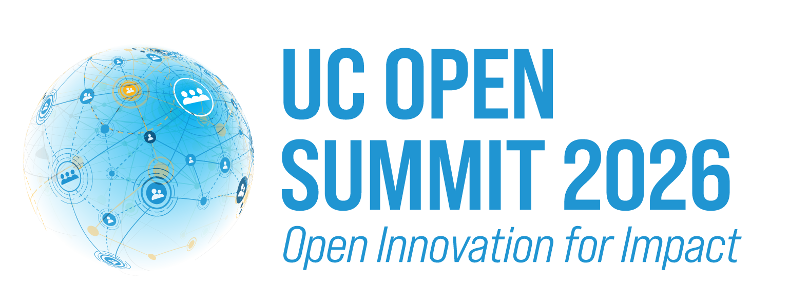

## April 22–23, 2026 | UC Berkeley

:::{div}
:class: register-btn
[REGISTER NOW](https://www.eventbrite.com/e/uc-open-summit-2026-tickets-1984939679013?aff=oddtdtcreator&keep_tld=true)
:::

As open source reshapes research, infrastructure, and how academia connects with industry, the UC Open Source Summit 2026 brings together two days of collaboration and partnership. Researchers, developers, students, and industry leaders from across the University of California system will explore what's next—from AI's impact on academia to building sustainable research infrastructure.

Discover emerging UC projects before they reach the mainstream, build partnerships on production-ready technologies, and connect with the next generation of contributors. Whether you're looking for research partners, hiring talent, solving technical problems, or contributing expertise back to the academic open source community, UC Open 2026 connects university innovation with real-world application.

This isn't just another conference. UC Open is:

- **Genuinely enjoyable**: we build in breaks long enough to recharge your attention span and have real conversations.
- **Small but mighty**: our deliberately limited capacity means you'll leave with real relationships, not just business cards. Every conversation matters when you're part of a curated community rather than a sea of strangers.
- **Warmly collaborative**: this event is for humans, not sales pitches. Whether you're a researcher, maintainer, contributor, or simply curious about open source innovation, you'll find your people here.

_Thanks to the generosity of our sponsors, UC Open is **free to attend** for all participants! We will provide coffee and tea service and lunch on both days, as well as an evening reception on Wednesday. When you register you will be asked to provide any dietary restrictions or concerns._

:::::::{div}
:class: sponsor-table

````{list-table}
:header-rows: 1

* - **Hosting Sponsor**
  - **Gold**
  - **Bronze**
  - **Network Support**
* - ```{image} ../../static/images/sponsors/bids-logo.png
    :alt: Berkeley Institute for Data Science
    :class: logo-light
    ```
    ```{image} ../../static/images/sponsors/bids-logo-dark.png
    :alt: Berkeley Institute for Data Science
    :class: logo-dark
    ```
  - ```{image} ../../static/images/sponsors/aws.png
    :alt: Amazon Web Services
    :class: logo-light
    ```
    ```{image} ../../static/images/sponsors/aws-light.svg
    :alt: Amazon Web Services
    :class: logo-dark
    ```
  - ```{image} ../../static/images/sponsors/redhat.svg
    :alt: Red Hat
    ```
  - ```{image} ../../static/images/sponsors/sloan.png
    :alt: Alfred P. Sloan Foundation
    :class: logo-light
    ```
    ```{image} ../../static/images/sponsors/Logo-1A-SMALL-Gold-White.png
    :alt: Alfred P. Sloan Foundation
    :class: logo-dark
    ```
````

:::::::

## Keynote Speakers

::::::{div}
:class: speaker-cards

::::{grid} 1 1 3 3

:::{card} David Charron

```{image} ./talks/speaker-headshots/charron_david.jpeg
:alt: David Charron
:width: 200px
```

[Open Software Entrepreneurship](./talks/open-software-entrepreneurship.md)
:::

:::{card} Nithya Ruff

```{image} ./talks/speaker-headshots/nithya-ruff.jpg
:alt: Nithya Ruff
:width: 200px
```

[The Role of Foundations In Advancing Open Collaboration and Innovation](./talks/role-of-foundations-in-open-source.md)
:::

:::{card} Kevin Esterling

```{image} ./talks/speaker-headshots/esterling_kevin.jpg
:alt: Kevin Esterling
:width: 200px
```

[Open Source AI and the Public Sphere: Two Paradoxes](./talks/open-source-ai-public-sphere.md)
:::

::::

::::::

## Schedule

### Wednesday, April 22

```{list-table}

* - 9:00–9:30
  - Coffee, Tea & Registration
* - 9:30–10:00
  - **Welcome from UC Berkeley OSPO**
* - 10:00–10:40
  - **Keynote:** David Charron (UC Berkeley)—*[Open Software Entrepreneurship](./talks/open-software-entrepreneurship.md)*
* - 10:40–11:00
  - Break & Networking
* - 11:00–11:50
  - **Panel: [Understanding Open Source Pathways—A Review of NSF POSE Funded Projects across the UC System](./talks/open-source-pathways-pose.md)**

    Chaired by Amber Budden (UCSB)\
    Panelists: Jarrod Millman (UC Berkeley), Harikrishna Kuttivelil (UCSC), Andrew Kahng (UCSD), Stephanie Lieggi (UCSC), Sanjit Seshia (UC Berkeley)
* - 11:50–12:30
  - **Keynote:** Nithya Ruff (Linux Foundation)—*[The Role of Foundations In Advancing Open Collaboration and Innovation](./talks/role-of-foundations-in-open-source.md)*
* - 12:30–2:00
  - Lunch & Networking

    *Poster Session (1:00–2:00)*
* - 2:00–3:45
  - **Breakout 1: Open Practices for Education and Training**

    - 2:00–2:15 *[UC OSPO Education Activities](./talks/uc-ospo-education-activities.md)*—Tim Dennis (UCLA)
    - 2:15–2:30 *[From Deployment to Ecosystem: Building Sustainable JupyterHub Infrastructure for Research and Teaching](./talks/sustainable-jupyterhub-infrastructure.md)*—Shane Knapp & Eric Van Dusen (UC Berkeley)
    - 2:30–2:45 *[Teaching and Mentorship Pathways into Open Source](./talks/teaching-and-mentorship.md)*—Emily Lovell (UCSC)
    - 2:45–3:00 *[Open Source Adaptive Tutoring for UC STEM](./talks/open-source-adaptive-tutoring-for-uc-stem.md)*—Ioannis Anastasopoulos & Zachary Pardos (UC Berkeley)
    - 3:00–3:45 *Facilitated Discussion moderated by Laura Langdon (UC OSPO Network)*

    **Breakout 2: Open Source Tools for Scientific Research**

    - 2:00–2:15 *[Unmapped Cities: Scaling Pedestrian Infrastructure Mapping with Tile2Net](./talks/unmapped-cities.md)*—Maryam Hosseini (UC Berkeley)
    - 2:15–2:30 *[Jupyter Book: Next-generation Tools for Creating Computational Narratives](./talks/jupyter-book-next-gen-tools.md)*—Chris Holdgraf (2i2c)
    - 2:30–2:45 *[From Silos to Standards: Open Data Modeling with LinkML](./talks/from-silos-to-standards-linkml.md)*—Nomi Harris (LBNL)
    - 2:45–3:00 *[Reflections on Building a High-Performance Open Source Microarchitectural Simulation Framework](./talks/open-source-microarchitectural-simulation.md)*—Heiner Litz (UCSC)
    - 3:00–3:45 *Facilitated Discussion moderated by James Davis (UCSC)*
* - 3:45–4:00
  - Break & Networking
* - 4:00–4:45
  - **Panel:** [Making a COSS Play](./talks/making-a-coss-play.md)

    Chaired by Karla Padilla (UCSD)\
    Panelists: Heather Meeker (Chinstrap Community), Mike Cohen (UC Berkeley), Dirk Riehle (FAU Erlangen-Nürnberg), Joel Kehle (UCLA)
* - 4:45–5:15
  - **[Lightning Intros](./talks/lightning-intros.md)**
* - 5:15–6:30
  - Reception
```

### Thursday, April 23

```{list-table}

* - 9:00–9:30
  - Coffee, Tea & Registration
* - 9:30–10:00
  - **Opening Session—OSPO Network Update**—Virginia Scarlett (UCSB) & Laura Langdon (UC OSPO Network)
* - 10:00–10:50
  - **Panel: [Influence of AI on Open Source and Open Scholarship](./talks/ai-influence-on-open-source.md)**

    Chaired by Leilani Gilpin (UCSC)\
    Panelists: Fernando Perez (UC Berkeley), Sahiba Chopra (UC Berkeley), Marit MacArthur (UC Davis), Tara Hernandez (MongoDB/UCSC)
* - 10:50–11:10
  - Break & Networking
* - 11:10–12:25
  - **Breakout 1: Enabling Impact Across California**

    - 11:10–11:25 *[Hidden in Plain Sight: Discovering the University of California Open Source Landscape](./talks/hidden-in-plain-sight-uc-open-source-landscape.md)*—Juanita Gomez (UCSC)
    - 11:25–11:40 *[More Than Just Storage: Support for Open Scholarship through Campus Collaborations](./talks/more-than-just-storage.md)*—Sam Teplitzky & Anna Sackmann (UC Berkeley)
    - 11:40–11:55 *[A Funder's Perspective on Promoting Best Practices in Data Sharing and Management](./talks/best-practices-data-sharing-and-management.md)*—Alden Conner (CIRM)
    - 11:55–12:25 *Facilitated Discussion moderated by Renea Davis-Leathers (UCOP)*

    **Breakout 2: Building Open Source and Open Science Ecosystems**

    - 11:10–11:25 *[The OCUDU Blueprint: A New Paradigm for Collaboration in Open Source Innovation](./talks/ocudu-blueprint.md)*—Ranny Haiby (Linux Foundation)
    - 11:25–11:40 *[Open Science Assistant (OSA): An Easy-to-Onboard AI Chatbot for Open Source Research Projects](./talks/open-science-assistant.md)*—Seyed Yahya Shirazi (UCSD)
    - 11:40–11:55 *[Using Continuous Integration to Ensure Accessible Experiences](./talks/continuous-integration-accessible-experiences.md)*—Michael Ball & Silas Santini (UC Berkeley)
    - 11:55–12:25 *Facilitated Discussion moderated by Emily Lovell (UCSC)*
* - 12:25–1:45
  - Lunch & Networking

    *Poster Session (1:00–1:45)*
* - 1:45–3:15
  - **Breakout 1: Open Source Tools for Public Benefit**

    - 1:45–2:00 *[An Open-Source Ecosystem for Building Weather Driven Agricultural Decision Tools](./talks/weather-driven-agricultural-decision-tools.md)*—Andy Lyons (UC ANR)
    - 2:00–2:15 *[Developing Environmental Wireless Sensor Networks with TockOS](./talks/environmental-wireless-sensor-networks-tockos.md)*—John Madden, Colleen Josephson, Jack Lin & Alec Levy (UCSC)
    - 2:15–2:30 *[Building Tools for Police Accountability](./talks/building-tools-for-police-accountability.md)*—Tarak Shah (UC Berkeley / BIDS)
    - 2:30–2:45 *[Communication Tools for Breaking Up with the Surveillance State](./talks/communication-tools-surveillance-state.md)*—Robin Riley (Open Chapters)
    - 2:45–3:15 *Facilitated Discussion moderated by Virginia Scarlett (UCSB)*

    **Breakout 2: Open Infrastructure for Collaborative Research**

    - 1:45–2:00 *[Making Jupyter Notebooks Accessible](./talks/making-jupyter-notebooks-accessible.md)*—Balaji Alwar & Chanbin Park (UC Berkeley)
    - 2:00–2:15 *[PeerSky in Academia: Create, Publish, and Share Research Without the Cloud](./talks/peersky-in-academia.md)*—Akhilesh Thite (UCSC)
    - 2:15–2:30 *[TRACE: Open Provenance Infrastructure for AI-Assisted Research](./talks/who-did-the-thinking.md)*—Oliver Muellerklein (UC Berkeley)
    - 2:30–2:45 *[Open Analytics Control Tower (OACT): A "Right to Replicate" Prototype for Infrastructure Risk](./talks/oact-right-to-replicate.md)*—Yidan Hu, Laisi Ma & Hao He
    - 2:45–3:15 *Facilitated Discussion moderated by Peter Brantley (UCD)*
* - 3:20–4:00
  - **Keynote:** Kevin Esterling (UC Riverside)—*[Open Source AI and the Public Sphere: Two Paradoxes](./talks/open-source-ai-public-sphere.md)*
* - 4:00–4:15
  - **Closing**
```

## For UC Community

- Showcase your open source work to industry and peer institutions
- Find collaborators across UC campuses working on similar challenges
- Learn from others already navigating open science, AI impact, and research software sustainability
- Connect student projects with mentors and real-world applications

## For Industry Partners

- Access emerging UC research before it reaches the mainstream
- Connect with next-generation open source talent from across the UC system
- Build collaborations on production-ready academic technologies
- Influence early-stage projects with real-world applications

## Sponsor UC Open 2026

Support open source collaboration and connect with top academic and industry talent by sponsoring UC Open 2026. Sponsorship provides visibility, networking, and alignment with a community driving innovation for public benefit.

Sponsorship tiers include:

- **Platinum ($10,000)**: Host a workshop session + premium event visibility
- **Gold ($8,000)**: Sponsor a presentation session + strong branding
- **Silver ($5,000)**: Exhibit space + event recognition
- **Bronze ($2,500)**: Recognition + networking opportunities
- **Hospitality Sponsorships (\$1,000–$2,000)**: Support meals, coffee breaks, and receptions

All sponsors are prominently recognized on signage, the website, and promotional materials. Let's build the future of open source together—[contact us](mailto:slieggi@ucsc.edu) to explore how sponsorship can align with your organization's goals.

:::::::{div}
:class: sponsor-showcase

:::::{div}
:class: sponsor-tier tier-hosting

### Hosting Sponsor

```{image} ../../static/images/sponsors/bids-logo.png
:alt: Berkeley Institute for Data Science
:class: logo-light
```

```{image} ../../static/images/sponsors/bids-logo-dark.png
:alt: Berkeley Institute for Data Science
:class: logo-dark
```

:::::

:::::{div}
:class: sponsor-tier tier-gold

### Gold

```{image} ../../static/images/sponsors/aws.png
:alt: Amazon Web Services
:class: logo-light
```

```{image} ../../static/images/sponsors/aws-light.svg
:alt: Amazon Web Services
:class: logo-dark
```

:::::

:::::{div}
:class: sponsor-tier tier-bronze

### Bronze

```{image} ../../static/images/sponsors/redhat.svg
:alt: Red Hat
```

:::::

:::::{div}
:class: sponsor-tier tier-network

### Network Support

```{image} ../../static/images/sponsors/sloan.png
:alt: Alfred P. Sloan Foundation
:class: logo-light
```

```{image} ../../static/images/sponsors/Logo-1A-SMALL-Gold-White.png
:alt: Alfred P. Sloan Foundation
:class: logo-dark
```

:::::

:::::::

## Code of Conduct

All participants are required to follow the [UC OSPO Network Events Code of Conduct](../code-of-conduct.md).

## Logistics

**Event Venue:** [The Brower Center, 2150 Allston Way, Berkeley, CA 94704](https://www.openstreetmap.org/directions?from=&to=37.8693,-122.2678#map=19/37.8693/-122.2678)

Accessibility: the Brower Center has steps and a ramp to the front entrance, and an elevator for those who cannot take the stairs. Wheelchair seating is available in the Goldman Theater auditorium—up to three wheelchairs can be accommodated with advance notice. Every bathroom has an accessible stall. Please [contact us](mailto:lalangdon@ucdavis.edu) if you have accessibility needs so we can make arrangements.

**Public transit:** The Brower Center is in downtown Berkeley, steps from the [Downtown Berkeley BART station](https://www.bart.gov/stations/dbrk) and [AC Transit](https://www.actransit.org/).

**Parking:** Weekday parking is available in the Oxford Garage directly below the Brower Center (enter on Kittredge St). The garage is open 7 AM–midnight with a live attendant 10 AM–7 PM on weekdays. See [ParkMe](https://www.parkme.com/) for rates.

**Bike parking:** Secure bike racks are available in the Oxford Garage (enter via Allston), staffed 10 AM–7 PM on weekdays. Free bike valet is also available at the Bike Station at 2023 Center Street (7 AM–7 PM weekdays), a few blocks away.

### Hotels

The following hotels are within walking distance of the Brower Center:

- [Residence Inn by Marriott](https://www.marriott.com/en-us/hotels/oakrr-residence-inn-berkeley/overview/) (3-minute walk)
- [Hotel Shattuck Plaza](https://www.hotelshattuckplaza.com/) (3-minute walk)
- [Nash Hotel](https://www.guestreservations.com/nash-hotel/booking) (8-minute walk)
- [Berkeley City Club](https://www.berkeleycityclub.com/) (10-minute walk)
- [Graduate by Hilton](https://www.hilton.com/en/hotels/oakgbgu-graduate-berkeley/) (18-minute walk)
- [DoubleTree by Hilton Hotel Berkeley Marina](https://www.hilton.com/en/hotels/jbkcadt-doubletree-berkeley-marina/) (12-minute drive)

Complete list on this [Google Map](https://maps.app.goo.gl/zMifXNmhsxBhnvon8), including a YMCA (4-minute walk) and UC Berkeley lodging options.

Preferred rates may be available for UC-affiliated attendees via [Connexxus](https://travel.ucop.edu/connexxus/).

### Nearby Airports

- Oakland International Airport (OAK)—about 12 miles, BART accessible
- San Francisco International Airport (SFO)—about 25 miles, BART accessible

### Travel Grants

A limited number of travel grants are available for UC affiliates attending UC Open 2026. [Apply here](https://docs.google.com/forms/d/e/1FAIpQLScKmZFlCdcX-umvpDUrU7tuS9WshcULxLR1SK4HwQ_QmRWcCg/viewform).
