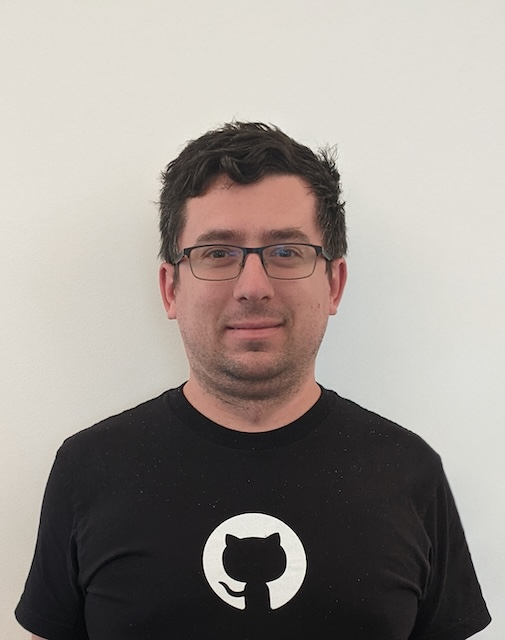

Mihai Maruseac is a member of the Google Open Source Security Team (GOSST), working on Supply Chain Security for ML. He is a co-lead on a Secure AI Framework (SAIF) workstream from Google. Under OpenSSF, Mihai chairs the AI/ML working group and the model signing project. Mihai is also a GUAC maintainer. Before joining GOSST, Mihai created the TensorFlow Security team and prior to Google, he worked on adding Differential Privacy to Machine Learning algorithms. Mihai has a PhD in Differential Privacy from UMass Boston.

## Session

[Technical Session: Open Source Software Security in AI](../sessions/oss-security-ai.md)
