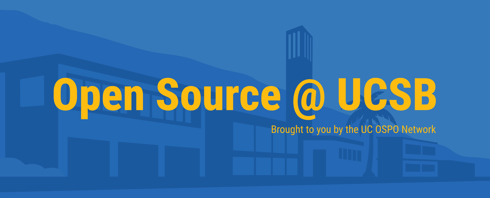

## Join us at the Open Source Meetup!

The Open Source meetup is a casual gathering where students, faculty, and staff
can come together over an interest in open source. **While the meetup was
formerly limited to UCSB, we now encourage UC affiliates from any campus to
join.** All backgrounds and experience levels are welcome. This is a great
opportunity to learn from others and be a part of a larger open source community
at UC!

## Stay informed

**Google calendar:** You can
[subscribe to our Google calendar here](https://calendar.google.com/calendar/u/0?cid=Y185OWU0NTZlMWQzZDFkNWQzMjBmYjM1MzY0NzYxN2ZiNzJkOWQ5YzAxZmM5MzY4ZWQ3NmU4MzBjN2U1OTEwOGU2QGdyb3VwLmNhbGVuZGFyLmdvb2dsZS5jb20)

For instructions, see
[this Google help page](https://support.google.com/calendar/answer/37100), under
the section "Use a link to add a public calendar".

**Email reminders:** Get meetup reminders and our newsletter by <a
  href="https://signup.e2ma.net/signup/2045162/1984731/"
  target="_blank">joining our mailing list</a>!

## Meeting format

We meet every two weeks, alternating between two formats:

🙋🏽**Topical Discussions:** the format is up to the organizer. The organizer may
give a talk about their own project, show their code for code review, facilitate
a group discussion on a topic of interest, or do something else. Meetings are
casual and shouldn't require too much formal preparation.

👩🏻‍💻**"Open Source Lounge":** These are co-working sessions where attendees can
work on their open source goals in a quiet, supportive environment. Bring your
laptop and some work to do such as documentation cleanup, a bug to work on, or
learning exercises to hone your coding skills. The meeting is two hours, but
drop by for as much or as little time as you like. You might be surprised by how
much you can get done in just half an hour.

### Upcoming meetings:

<!-- Button to sign up sheet -->

  <a href="https://docs.google.com/spreadsheets/d/19SdbFZwA4JrZBf5GsVqIYkOeVkieI-xvy2NJnR7kFeE/edit?usp=sharing" style="
    display: inline-block;
    padding: 1rem 2rem;
    background-color: #003660;
    color: white;
    text-align: center;
    text-decoration: none;
    font-size: 1.25rem;
    border-radius: 8px;
    font-family: sans-serif;
  "
    target = "_blank"
    onmouseover="this.style.backgroundColor='#005799'"
    onmouseout="this.style.backgroundColor='#003660'"
  >
    Sign up to lead a meeting here!
  </a>

<table style="width:70%">
  <tr>
    <th>Date</th>
    <th>Time</th>
    <th>Topic</th>
    <th>Link</th>
    <th>Other notes</th>
  </tr>
  <tr>
    <td>March 4, 2026</td>
    <td>12pm-2pm</td>
    <td>Open Source Lounge</td>
    <td><a href="https://ucsb.zoom.us/j/87499258423"
    target="_blank">
    Join the meeting now</a>
    </td>
    <td>Hybrid meeting: Library room 1411 and Zoom</td>
  </tr>
    <tr>
    <td>March 18, 2026</td>
    <td>12pm-1pm (scheduled program) + 1-1:30pm (unprogrammed hangout)</td>
    <td>A conversation with Matthias Köppe, maintainer of SageMath</td>
    <td><a
    href="https://ucsb.zoom.us/meeting/register/hU351-40Tp2fkojZX9gLmw"
    target="_blank">
    Register</a>
    </td>
    <td>Zoom meeting</td>
  </tr>
    <tr>
    <td>April 1, 2026</td>
    <td>12pm-2pm</td>
    <td>Open Source Lounge</td>
    <td><a href="https://ucsb.zoom.us/j/87499258423"
    target="_blank">
    Join the meeting now</a>
    </td>
    <td>Hybrid meeting: Library room 1411 and Zoom</td>
  </tr>
</table>

### Past topics:

- A new project from the UCSB Library: The OSS Sustainability Playbook
- Open-washing and the EU AI Act
- Our favorite lesser-known open source tools
- Community-building with Chrissy Rissmeyer, Prof. Rich Wolski, and Prof.
  Trissalyn Nelson
- Open Source Licensing with TIA's Pasquale Ferrari
- Getting started in open source
- Introducing the UCSB Library's Open Source Program

### Logistics

We meet every other Wednesday at noon.

**Topical discussions** are 12-1pm on Zoom. (Formerly in room 1312 in the UCSB
Library, our discussions have moved to Zoom for greater accessibility.)

**Open Source Lounge** sessions are 12-2pm and are hybrid format: join us in
room 1411 in the Sara Miller McCune Arts Library (which is inside the UCSB
library), or on Zoom. The lounge sessions are like office hours--come and go as
your schedule allows!

### Get involved!

Interested in helping co-organize the meetup? Let us know! Send us an email at
ospo@library.ucsb.edu.

  <a href="santa-barbara.html">
    Back to UCSB Open Source Program Page
  </a>

