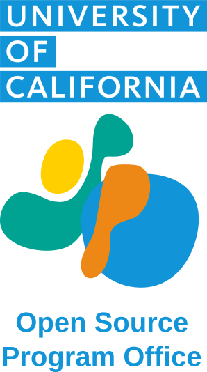

  

    
  

  

Welcome to the University of California Open Source Program Office Network!

The UC OSPO Network is a groundbreaking initiative that harnesses the collective power of six UC campuses to revolutionize open-source practices in academia.
This collaborative effort aims to amplify the impact of research, public service, and education across the University of California system.

Join us in shaping the future of open-source in academia and beyond.

[Read more about the UC OSPO Network](about.md).

  

