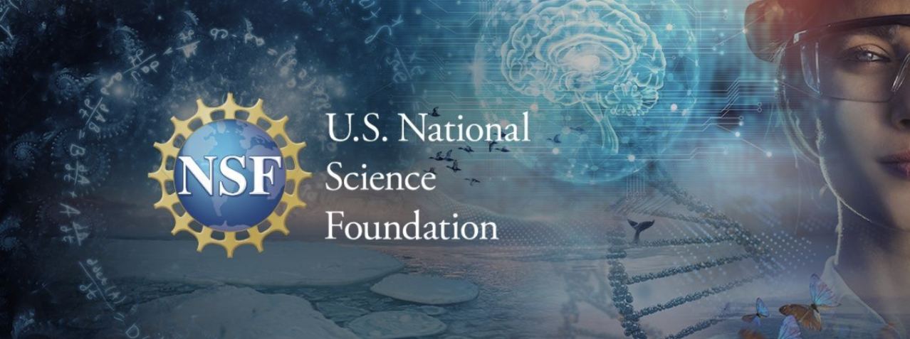

On July 2, 2026, the UC open source community reached an exciting new milestone. Our monthly campus-specific gatherings officially transitioned into one unified all-campus virtual meetup. This first meetup in the series was hosted by the [UC Davis OSPO](https://library.ucdavis.edu/ospo/) team, setting a powerful precedent for how our network can collaborate, share resources, and grow together. Under this new format, the first half of the meeting consists of workshops or guest speakers moderated by one UC campus. The second half is dedicated to community updates and chats. The OSPO Monthly Meetup also has expanded its network by inviting participants from outside the UC system, such as a program manager from ArchivesSpace, proving that our network is becoming a hub for the broader open source community.

## Demystifying the NSF PESOSE Grant

The logo of the US National Science Foundation in the middle with a person in a lab outfit on the right edge of the banner.

The spotlight of the July meetup was an in-depth panel discussion on the National Science Foundation’s [PESOSE](https://www.nsf.gov/funding/opportunities/pesose-pathways-enable-secure-open-source-ecosystems/nsf26-506/solicitation) (Pathways to Enable Secure Open-Source Ecosystems) program. [Vessela Ensberg](https://library.ucdavis.edu/person/vessela-ensberg/), UC Davis Library’s Associate Director of Product & Strategy, introduced the three tracks of PESOSE that cover a wide range of awards:

1. Scoping and planning governance for the open source tool;
2. Establishing and expanding the community, governance, and structure around a software;
3. Safety, privacy, and security.

Following the introduction, panelists [Katia Obraczka](https://cider.ucsc.edu/people/katia-obraczka/), Campus Director of CITRIS and the UC Santa Cruz Banatao Institute, and [Ana Lucia Cordova](https://research.ucdavis.edu/about/leadership/strategic-initiatives-director/), Strategic Initiatives Director at UC Davis Office of Research, shared invaluable advice for navigating this funding landscape.

Sharing her team’s experience after receiving the grant, Obraczka highlighted the value of the customer discovery training provided by the [I-Crops Northwest Hub](https://www.nwicorps.org/leadership-and-faculty). The training helped the team better understand how to scope their projects. Cordova added that the solicitation’s broader purpose is to support the building of an ecosystem. She noted that the bulk of a proposal's budget should focus on governance, onboarding, and community stewardship, rather than coding alone. Both speakers encouraged researchers not to work in isolation and recommended turning to their local campus OSPOs for help with scoping proposals and connecting with essential backbone organizations.

## Community Updates: Sloan Funding and Get Involved

As the momentum continued into community updates, [Stephanie Lieggi](https://ucsc-ospo.github.io/author/stephanie-lieggi/), UCSC OSPO Executive Director, announced thrilling news – nearly $500,000 in additional funding from the [Sloan Foundation](https://sloan.org/) to transition the grant into an institutionalized system. Alongside this practical support, [Virginia Scarlett](https://virginiascarlett.com/) shared that the network's organizing team is launching open-to-the-public working groups, where people can find like-minded others to cooperate on tasks such as helping shape open-source licensing guidelines or designing educational materials.

At the [next meeting](https://cdss.berkeley.edu/events/ospo-all-campus-virtual-meetup-ai-oss) on August 6th, a group of researchers from UCSB’s [NCEAS](https://www.nceas.ucsb.edu/) will be presenting on how AI is affecting open-source workflows and sharing practical rules for using AI in a research lab. We hope to have you join us there!

To stay in touch with the BIDS community and join the conversation, please visit follow us on [Bluesky](https://bsky.app/profile/ucbids.bsky.social) & [LinkedIn](https://www.linkedin.com/company/berkeley-institute-for-data-science-bids-/) and subscribe to the [BIDS newsletter](https://bids.berkeley.edu/join/mailing-lists).
