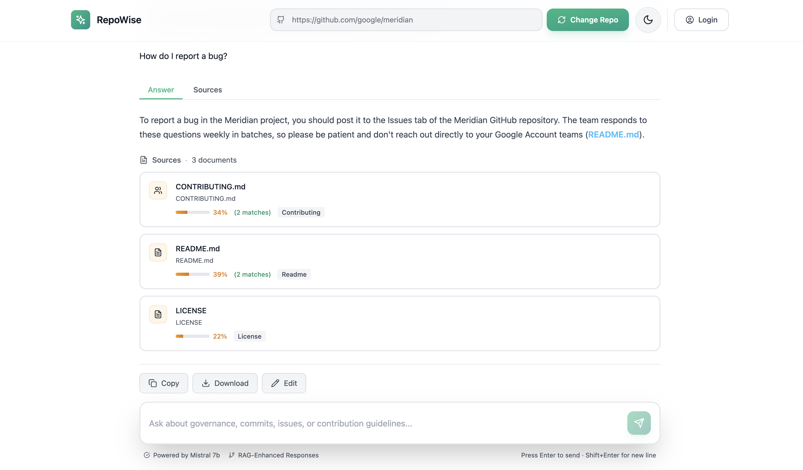
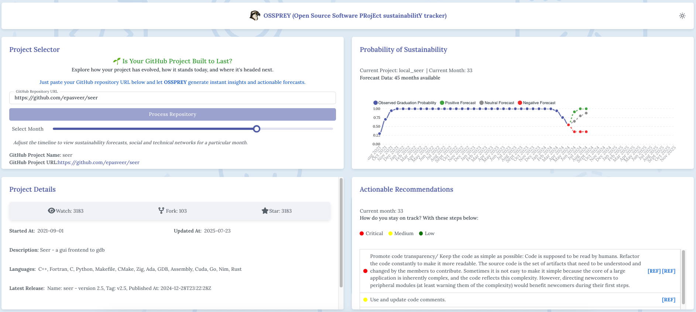
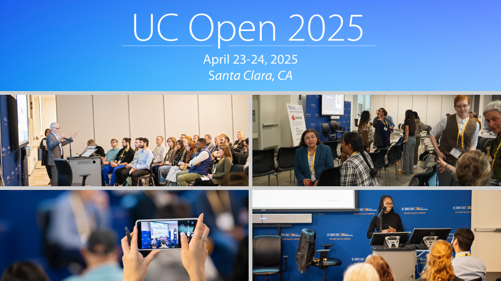
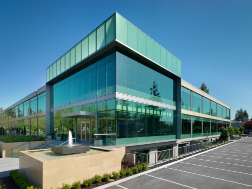
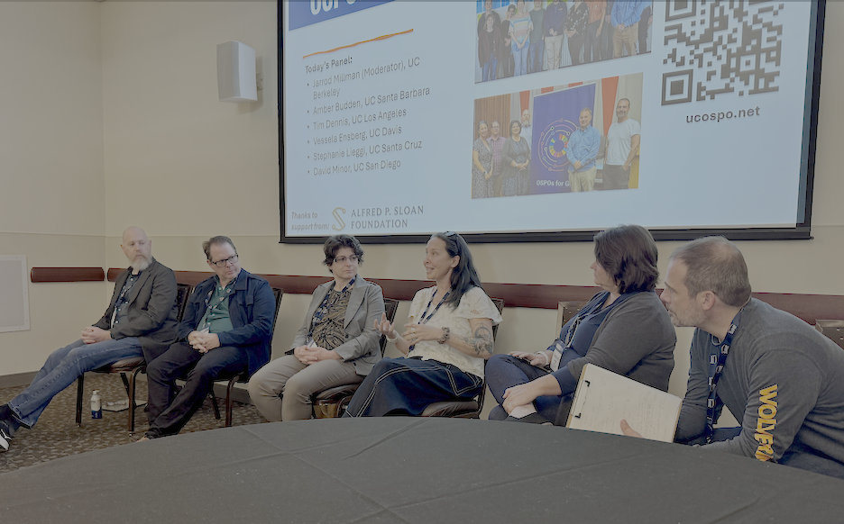
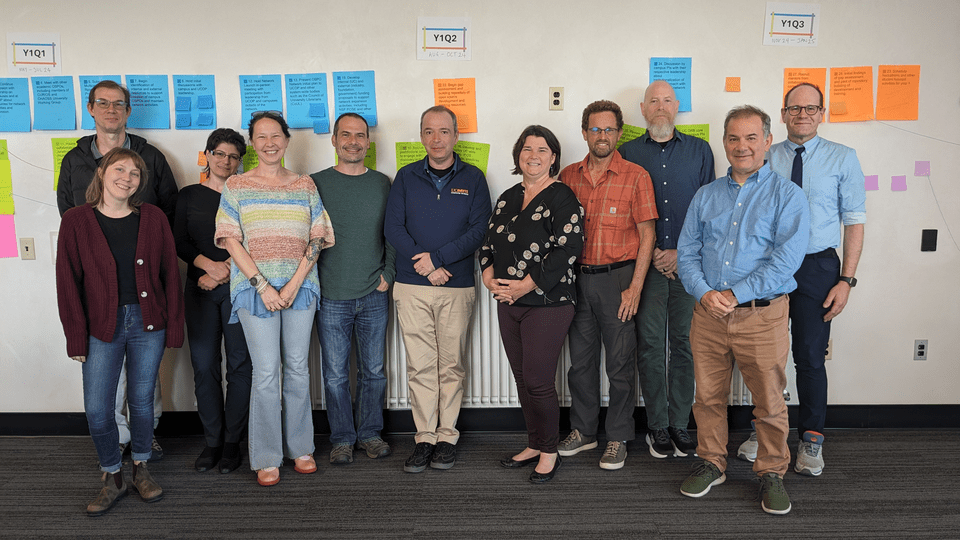
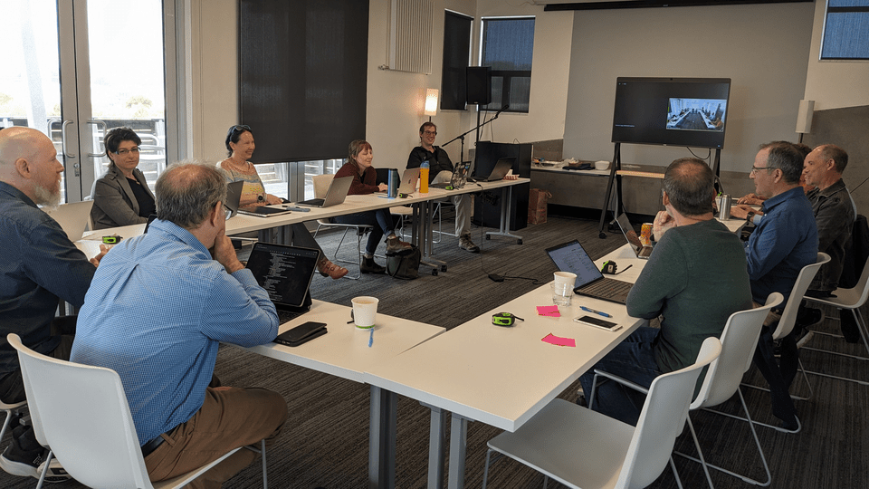

:::::{div}
:class: blog-cards
::::{grid} 1 2 3 3

:::{card} Introducing RepoWise
:link: /posts/repowise-announcement
:footer: November 25, 2025

Natural-language dialogue with OSS repositories, transforming how developers and researchers explore governance, contributions, and community health.
:::

:::{card} Introducing OSSPREY
:link: /posts/ossprey-announcement
:footer: September 11, 2025

AI-powered sustainability forecasting and evidence-based recommendations to help open source maintainers keep projects healthy.
:::

:::{card} The First Annual UC Open
:link: /posts/uc-open-25-report
:footer: May 26, 2025

Highlights from the UC Open 2025 Summit — keynotes, panels, and discussions on open source innovation across the UC system.
:::

:::{card} UC OSPO Network Launches Open Source Survey
:link: /posts/survey-launch
:footer: April 16, 2025

A network-wide survey to understand the open source practices and needs of the University of California community.
:::

:::{card} OSPOs in Higher Ed: A Love Data Week Recap
:link: /posts/love-data-week-2025
:footer: March 10, 2025

UC Love Data Week 2025 session highlights how OSPOs support open-source research and software sustainability across the UC system.
:::

:::{card} Save the Date! UC Open 2025
:link: /posts/uc-open-save-the-date
:footer: February 5, 2025

Announcing UC Open 2025 — celebrating open source and open science throughout the UC system at the UCSC Silicon Valley Campus.
:::

:::{card} OSPO Network @ UC Tech
:link: /posts/ospo-at-uc-tech
:footer: December 3, 2024

The UC OSPO Network hosted two sessions at UC Tech 2024 — a panel introduction and a Birds of a Feather community discussion.
:::

:::{card} Charting a Course for Open Source Innovation
:link: /posts/charting-a-course
:footer: June 12, 2024

A recap of the UC-wide OSPO Network kick-off event, bringing together six campuses to align on open source strategy.
:::

:::{card} UC OSPO Network Launched
:link: /posts/launch
:footer: May 31, 2024

The Alfred P. Sloan Foundation funds a two-year pilot to create coordinated open source program offices across the UC system.
:::

::::
:::::
