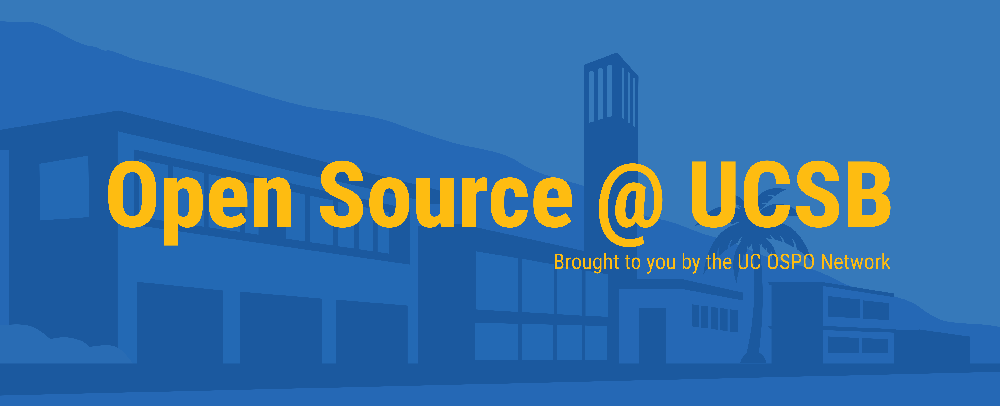

[<< Back to UCSB Open Source Program Page](/santa-barbara)

## Join us at the UCSB Open Source Lounge!

The UCSB Open Source lounge is a casual co-working group where students,
faculty, and staff come together and work on their open source goals in a
supportive environment. Join us and be a part of a larger open source community
at UC.

## Stay informed

- **Google calendar:** You can
  [subscribe to our Google calendar here](https://calendar.google.com/calendar/u/0?cid=Y185OWU0NTZlMWQzZDFkNWQzMjBmYjM1MzY0NzYxN2ZiNzJkOWQ5YzAxZmM5MzY4ZWQ3NmU4MzBjN2U1OTEwOGU2QGdyb3VwLmNhbGVuZGFyLmdvb2dsZS5jb20)
  - For instructions, see
    [this Google help page](https://support.google.com/calendar/answer/37100),
    under the section "Use a link to add a public calendar".
- **Email:** Get reminders in our newsletter by
  [joining our mailing list](https://signup.e2ma.net/signup/2045162/1984731/)!
- **Slack:** Slack with us by joining the
  [UC OSPO Network Slack workspace](https://join.slack.com/t/uc-ospo-network/shared_invite/zt-3ecp5b20z-ECL~4DkCUslB0t3mbH9xUg).

## Logistics

**NEW!** Starting on October 1st, 2026, we will meet every week at a new time:

**Thursdays, 2:30-4:30pm in Library room 1411 or on Zoom.**

Room 1411 is in the Sara Miller McCune Arts Library, which is inside the UCSB
library.

The UCSB Open Source Lounge is a hybrid meeting, now meeting weekly on Thursday
afternoons. Bring your laptop and some work to do such as documentation cleanup,
a bug to work on, or learning exercises to hone your coding skills. The meeting
is two hours, but drop by for as much or as little time as you like. All
backgrounds and experience levels are welcome.

## NEW! OS Lounge: Evening edition 🍕

Attention students! Check out our new quarterly series: The Open Source Lounge -
Evening Edition.

Come learn about what open source software/hardware is and how you can get
involved. Featuring guest speakers with wisdom and resources for student hackers
and tinkerers. This event is for UCSB graduate and undergraduate students. Pizza
will be served for in-person attendees who registered in advance.

Our first meeting will be **Thu. Oct. 8, 2026 from 6pm-7:30pm in UCSB Library
room 2509 and Zoom** (hybrid meeting). Our guest speaker is Alex Jenkins,
Computer Engineering student at Georgia Tech and founder of the
[LibreTech Collective](https://ltc.cc.gatech.edu/), a student organization
dedicated to Free, Libre, & Open-Source software, hardware, and knowledge.

::::{div}
:class: btn-center-wrapper

<a href="https://docs.google.com/forms/d/e/1FAIpQLSc9cOkCsx6K43LbGQSOoLgO8s96cFu7i3hqbAiNaCuJG9wXPQ/viewform?usp=dialog" class="btn-ucsb-primary">Register
for the 10/8 evening edition</a>
::::

## Looking for other ways to socialize?

If the Open Source Lounge doesn't work for you, you can still socialize with us!
We're on Slack (see Stay informed section above), and we're in the
[monthly all-campus Open Source meetup](https://ucospo.net/events/#all-campus-virtual-meetups-monthly).
Note: The UCSB Open Source Meetup has now merged with the all-campus Open Source
meetup.

## Get involved!

Interested in helping co-organize the lounge? Have other ideas for building open
source community at UCSB? Let us know! Send us an email at
[ospo@library.ucsb.edu](mailto:ospo@library.ucsb.edu).

[<< Back to UCSB Open Source Program Page](/santa-barbara)
